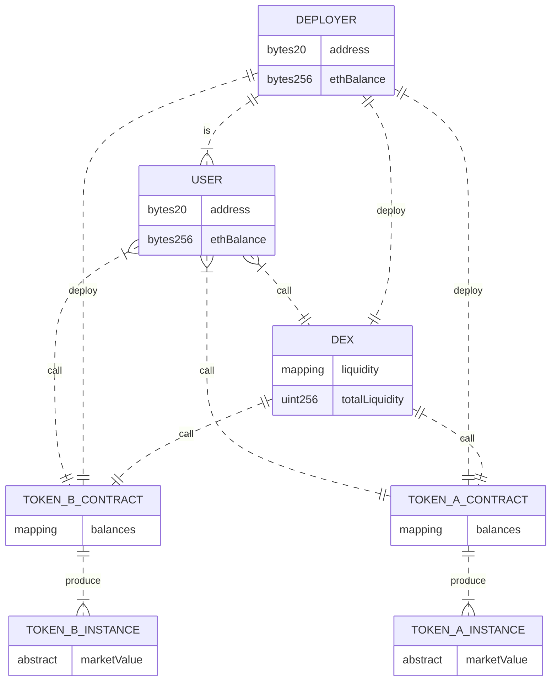

```mermaid
erDiagram
    USER }|..|| TOKEN_A_CONTRACT : call
    USER }|..|| TOKEN_B_CONTRACT : call
    USER }|..|| DEX : call

    USER {
        bytes20 address
        bytes256 ethBalance
    }

    TOKEN_A_CONTRACT {
        mapping balances
    }

    TOKEN_B_CONTRACT {
        mapping balances
    }

    TOKEN_A_CONTRACT ||..|{ TOKEN_A_INSTANCE: produce
    TOKEN_B_CONTRACT ||..|{ TOKEN_B_INSTANCE: produce

    TOKEN_A_INSTANCE {
        abstract marketValue
    }

    TOKEN_B_INSTANCE {
        abstract marketValue
    }

    DEPLOYER ||..|| TOKEN_B_CONTRACT: deploy
    DEPLOYER ||..|| TOKEN_A_CONTRACT: deploy
    DEPLOYER ||..|| DEX: deploy

    DEPLOYER {
        bytes20 address
        bytes256 ethBalance
    }

    DEPLOYER ||..|{ USER: is

    DEX ||..|| TOKEN_B_CONTRACT: call
    DEX ||..|| TOKEN_A_CONTRACT: call

    DEX {
        mapping liquidity
        uint256 totalLiquidity
    }
```
