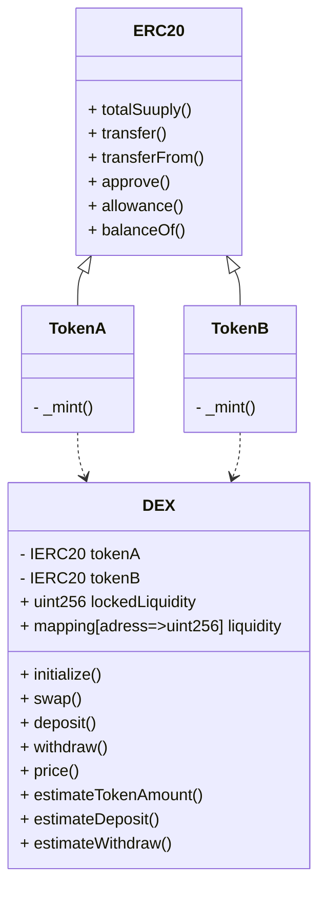

```mermaid
classDiagram
    class DEX {
        - IERC20 tokenA
        - IERC20 tokenB
        + uint256 lockedLiquidity
        + mapping[adress=>uint256] liquidity
        + initialize()
        + swap()
        + deposit()
        + withdraw()
        + price()
        + estimateTokenAmount()
        + estimateDeposit()
        + estimateWithdraw()
    }

    class TokenA {
        - _mint()
    }

    class TokenB {
        - _mint()
    }

    class ERC20 {
        + totalSuuply()
        + transfer()
        + transferFrom()
        + approve()
        + allowance()
        + balanceOf()
    }

    ERC20 <|-- TokenA
    ERC20 <|-- TokenB

    TokenA ..> DEX
    TokenB ..> DEX
```
