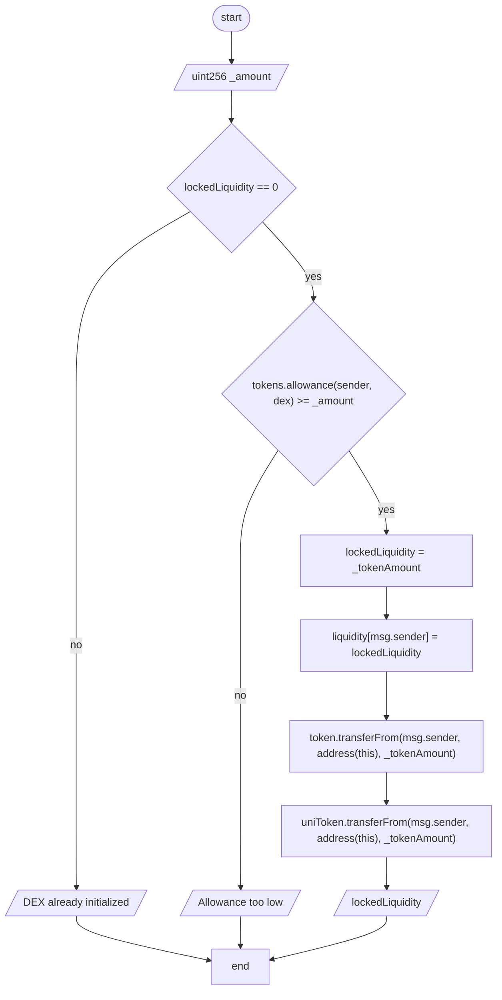

```mermaid
graph TD
    A([start]) --> B
    B[/uint256 _amount/] --> C
    C{lockedLiquidity == 0} --> |no| D
    C --> |yes| E
    D[/DEX already initialized/] --> N
    E{"tokens.allowance(sender, dex) >= _amount"} --> |no| G
    E --> |yes| I
    G[/Allowance too low/] --> N
    I[lockedLiquidity = _tokenAmount] --> J
    J["liquidity[msg.sender] = lockedLiquidity"] --> K
    K["token.transferFrom(msg.sender, address(this), _tokenAmount)"] --> L
    L["uniToken.transferFrom(msg.sender, address(this), _tokenAmount)"] --> M
    M[/lockedLiquidity/] --> N[end]
```
