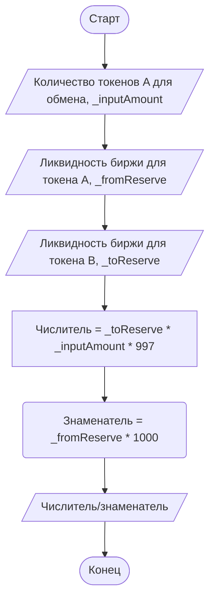

```mermaid
graph TD
    E([Старт]) --> Q
    Q[/Количество токенов A для обмена, _inputAmount/] --> A
    A[/Ликвидность биржи для токена A, _fromReserve/] --> AA
    AA[/Ликвидность биржи для токена B, _toReserve/] --> AAA
    AAA[Числитель = _toReserve * _inputAmount * 997] --> B(Знаменатель = _fromReserve * 1000)
    B --> C[/Числитель/знаменатель/]
    C --> W([Конец])
```
