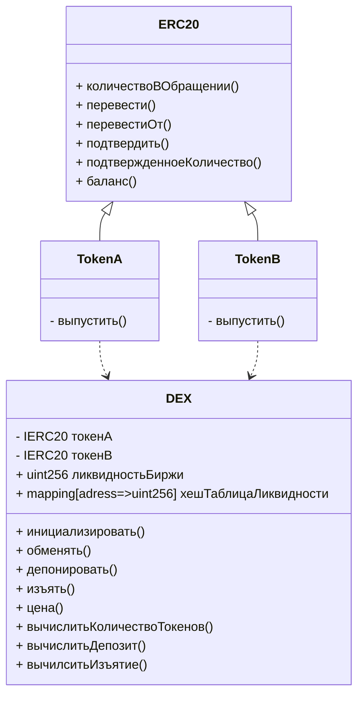

```mermaid
classDiagram
    class DEX {
        - IERC20 токенА
        - IERC20 токенВ
        + uint256 ликвидностьБиржи
        + mapping[adress=>uint256] хешТаблицаЛиквидности
        + инициализировать()
        + обменять()
        + депонировать()
        + изъять()
        + цена()
        + вычислитьКоличествоТокенов()
        + вычислитьДепозит()
        + вычилситьИзъятие()
    }

    class TokenA {
        - выпустить()
    }

    class TokenB {
        - выпустить()
    }

    class ERC20 {
        + количествоВОбращении()
        + перевести()
        + перевестиОт()
        + подтвердить()
        + подтвержденноеКоличество()
        + баланс()
    }

    ERC20 <|-- TokenA
    ERC20 <|-- TokenB

    TokenA ..> DEX
    TokenB ..> DEX
```
