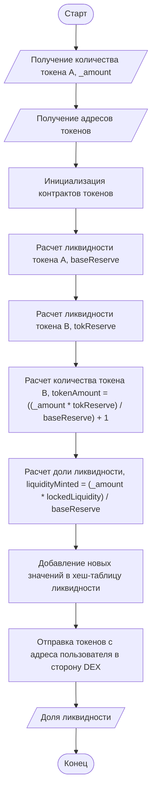

```mermaid
graph TD
    E([Старт]) --> Q
    Q[/Получение количества токена А, _amount/] --> A
    A[/Получение адресов токенов/] --> B

    B[Инициализация контрактов токенов] --> C
    C[Расчет ликвидности токена A, baseReserve] --> D
    D[Расчет ликвидности токена B, tokReserve] --> F

    F["Расчет количества токена B, tokenAmount = ((_amount * tokReserve) / baseReserve) + 1"] --> G
    G["Расчет доли ликвидности, liquidityMinted = (_amount * lockedLiquidity) / baseReserve"] --> H

    H[Добавление новых значений в хеш-таблицу ликвидности] --> I
    I[Отправка токенов с адреса пользователя в сторону DEX] --> J
    J[/Доля ликвидности/] --> K([Конец])
```
