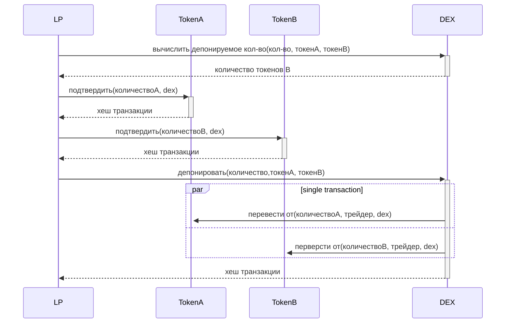

```mermaid
sequenceDiagram
    participant L as LP
    participant A as TokenA
    participant B as TokenB
    participant D as DEX

    L->>+D: вычислить депонируемое кол-во(кол-во, токенA, токенB)
    D-->>-L: количество токенов B

    L->>+A: подтвердить(количествоА, dex)
    A-->>-L: хеш транзакции
    L->>+B: подтвердить(количествоВ, dex)
    B-->>-L: хеш транзакции

    L->>+D: депонировать(количество,токенА, токенВ)
    par single transaction
        D->>+A: перевести от(количествоА, трейдер, dex)
    and
        D->>+B: перверсти от(количествоВ, трейдер, dex)
    end
    D-->>-L: хеш транзакции
```
