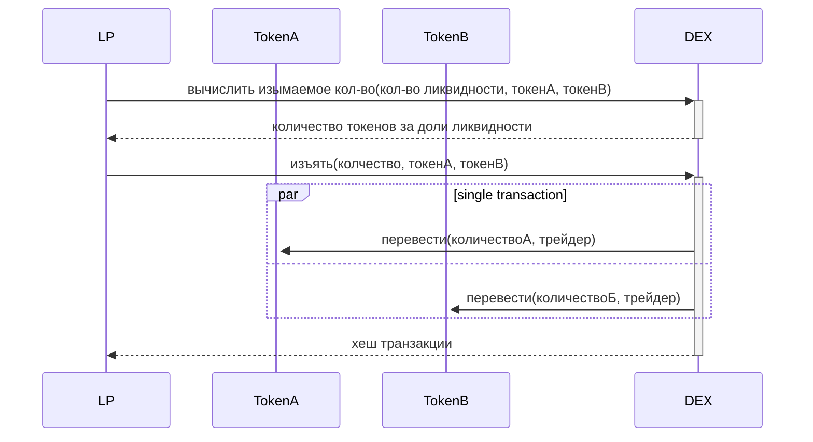

```mermaid
sequenceDiagram
    participant L as LP
    participant A as TokenA
    participant B as TokenB
    participant D as DEX

    L->>+D: вычислить изымаемое кол-во(кол-во ликвидности, токенA, токенB)
    D-->>-L:  количество токенов за доли ликвидности

    L->>+D: изъять(колчество, токенA, токенB)
    par single transaction
        D->>+A: перевести(количествоА, трейдер)
    and
        D->>+B: перевести(количествоБ, трейдер)
    end
    D-->>-L: хеш транзакции
```
