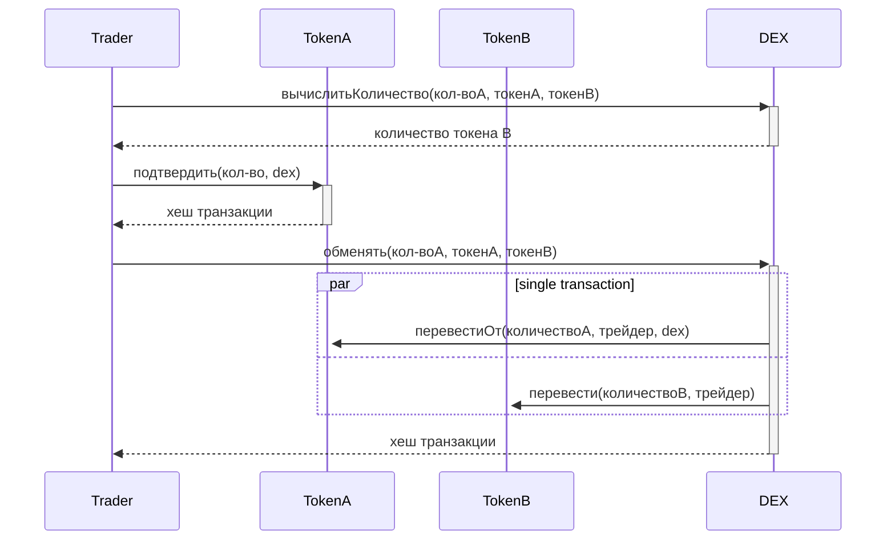

```mermaid
sequenceDiagram
    participant T as Trader
    participant A as TokenA
    participant B as TokenB
    participant D as DEX

    T->>+D: вычислитьКоличество(кол-воА, токенА, токенВ)
    D-->>-T: количество токена В
    T->>+A: подтвердить(кол-во, dex)
    A-->>-T: хеш транзакции
    T->>+D: обменять(кол-воА, токенА, токенВ)
    par single transaction
        D->>+A: перевестиОт(количествоА, трейдер, dex)
    and
        D->>+B: перевести(количествоВ, трейдер)
    end
    D-->>-T: хеш транзакции
```
