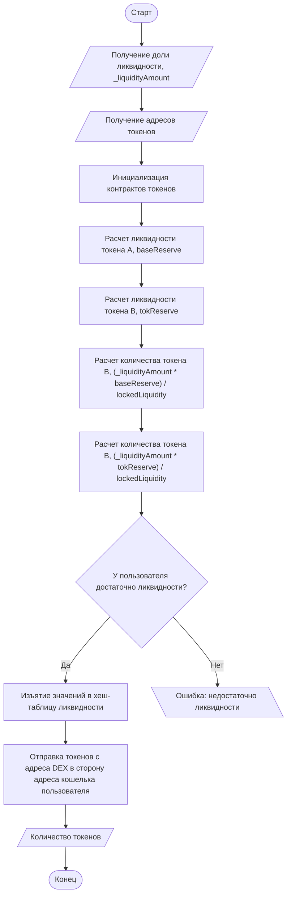

```mermaid
graph TD
    E([Старт]) --> Q
    Q[/Получение доли ликвидности, _liquidityAmount/] --> A
    A[/Получение адресов токенов/] --> B

    B[Инициализация контрактов токенов] --> C
    C[Расчет ликвидности токена A, baseReserve] --> D
    D[Расчет ликвидности токена B, tokReserve] --> F

    F["Расчет количества токена B, (_liquidityAmount * baseReserve) / lockedLiquidity"] --> G
    G["Расчет количества токена B, (_liquidityAmount * tokReserve) / lockedLiquidity"] --> H

    H{У пользователя достаточно ликвидности?} -->|Да| HH
    H -->|Нет| HHH[\Ошибка: недостаточно ликвидности\]

    HH[Изъятие значений в хеш-таблицу ликвидности] --> I
    I[Отправка токенов с адреса DEX в сторону адреса кошелька пользователя] --> J
    J[/Количество токенов/] --> K([Конец])
```
