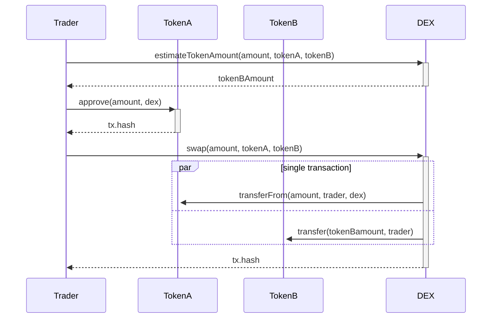

```mermaid
sequenceDiagram
participant T as Trader
participant A as TokenA
participant B as TokenB
participant D as DEX

    T->>+D: estimateTokenAmount(amount, tokenA, tokenB)
    D-->>-T: tokenBAmount
    T->>+A: approve(amount, dex)
    A-->>-T: tx.hash
    T->>+D: swap(amount, tokenA, tokenB)
    par single transaction
        D->>+A: transferFrom(amount, trader, dex)
    and
        D->>+B: transfer(tokenBamount, trader)
    end
    D-->>-T: tx.hash
```
