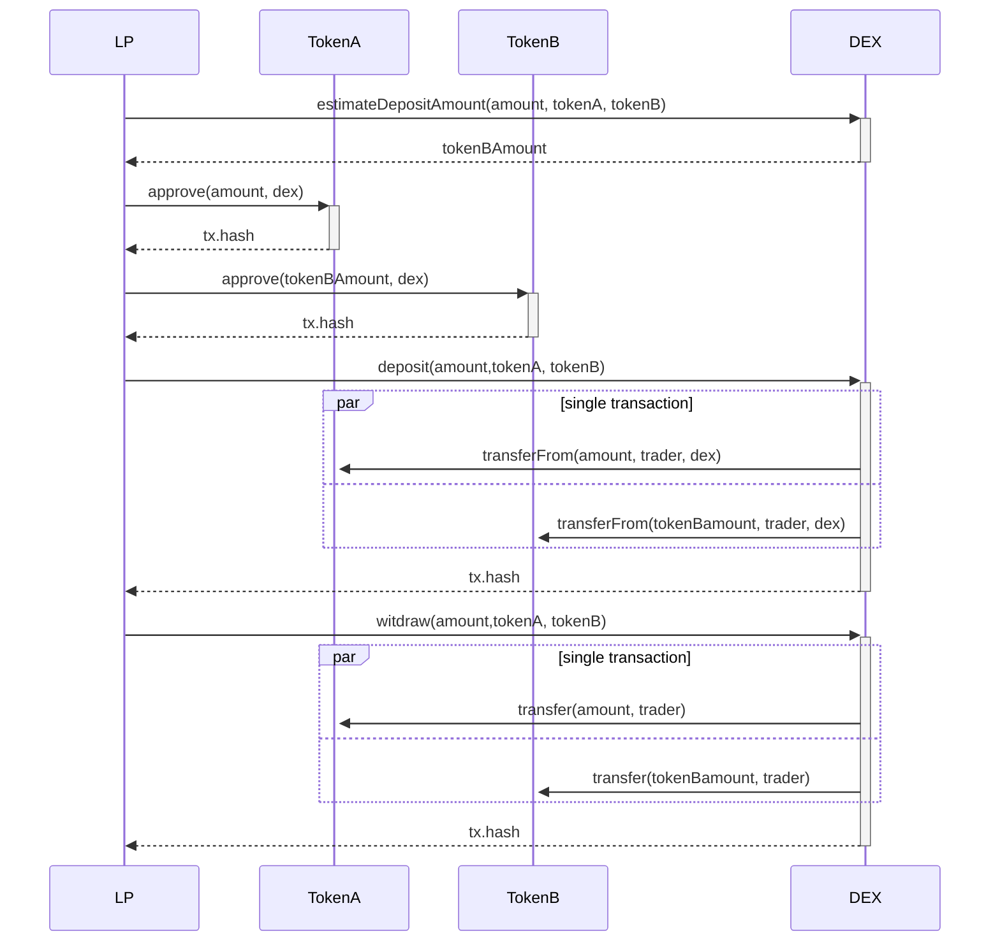

```mermaid
sequenceDiagram
    participant L as LP
    participant A as TokenA
    participant B as TokenB
    participant D as DEX

    L->>+D: estimateDepositAmount(amount, tokenA, tokenB)
    D-->>-L: tokenBAmount

    L->>+A: approve(amount, dex)
    A-->>-L: tx.hash
    L->>+B: approve(tokenBAmount, dex)
    B-->>-L: tx.hash

    L->>+D: deposit(amount,tokenA, tokenB)
    par single transaction
        D->>+A: transferFrom(amount, trader, dex)
    and
        D->>+B: transferFrom(tokenBamount, trader, dex)
    end
    D-->>-L: tx.hash

    L->>+D: witdraw(amount,tokenA, tokenB)
    par single transaction
        D->>+A: transfer(amount, trader)
    and
        D->>+B: transfer(tokenBamount, trader)
    end
    D-->>-L: tx.hash
```
