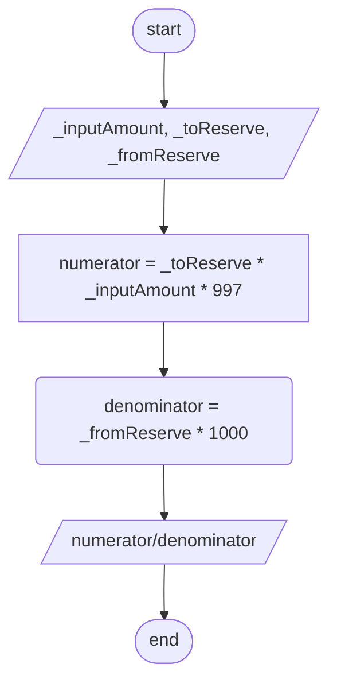

```mermaid
graph TD
    E([start]) --> Q
    Q[/_inputAmount, _toReserve, _fromReserve/] --> A
    A[numerator = _toReserve * _inputAmount * 997] --> B(denominator = _fromReserve * 1000)
    B --> C[/numerator/denominator/]
    C --> W([end])
```
