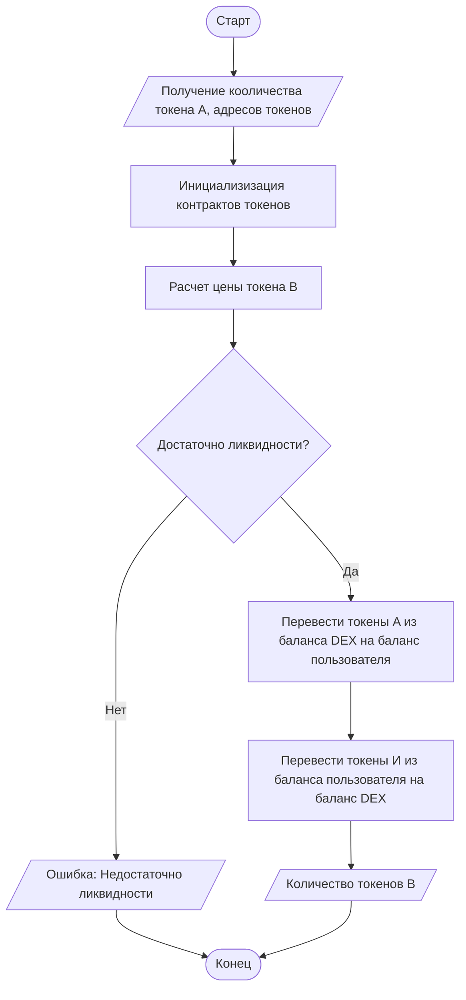

```mermaid
graph TD
    E([Старт]) --> Q
    Q[/Получение кооличества токена А, адресов токенов/] --> A
    A[Инициализизация контрактов токенов] --> B
    B[Расчет цены токена B] --> C

    C{Достаточно ликвидности?} -->|Нет| D[/Ошибка: Недостаточно ликвидности/]
    C -->|Да| F[Перевести токены A из баланса DEX на баланс пользователя]
    F --> G[Перевести токены И из баланса пользователя на баланс DEX]
    G --> H[/Количество токенов B/]

    D --> I([Конец])
    H --> I([Конец])
```
